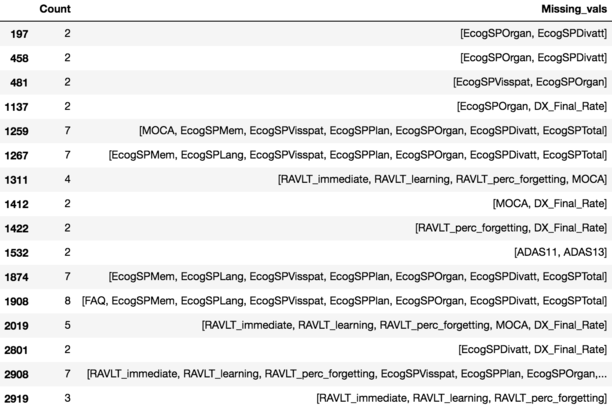
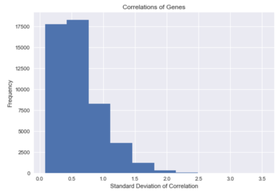
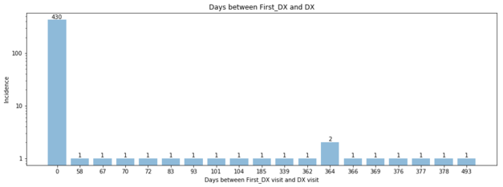

Before a model could be built, the data had to be cleaned and processed.

----------

Preliminary data cleaning
-------------

In order build our data set, we extracted gene expression data for all ADNI2 patients, as well as their corresponding cognitive tests from ADNIMERGE. ADNI2 was used as it was the largest sample size for any single protocol in the ADNI database. The data was merged using the patient IDs, a value unique to each patient. 

To control for differing numbers of visits, only the cognitive tests from the visit where gene expression data was taken were used. This allowed us to combine each patient's tests and gene expression into a single row representing one visit, vastly improving consistency in the collection protocols for the data.

From there, we recorded the dates of the patient's first and last visits, the days in between the visits, the final diagnosis (of Alzheimer's dementia), and the diagnosis on the day of the gene expression collection (or most recent diagnosis, since a null value was present for patients with no updated diagnosis). This allowed us to have a complete picture of the patients visits to the doctor, and the progression of their disease, while minimizing the amount of longitudinal data required.

Finally, standard data processing was performed. Types were corrected, features were standardized and diagnoses were converted to numerical representations.

To view our process, please see [our documented cleaning](Cleaning_notebook.md).

Featuring: too many features!
-------------
Below is a table describing the features contained in the ADNIMERGE dataset. 'bl' stands for baseline, meaning the value from the very first visit. There were features describing study data such as participant ID numbers, visit code, and examination date which we did not include. We also did not consider the features describing demographics information such as age, sex, and ethnicity.

| Feature                                  | Description                              | Purpose                          |
| ---------------------------------------- | ---------------------------------------- | -------------------------------- |
| FDG, FDG_bl                              | Average 18F-fluorodeoxyglucose position emission tomography (PET) | Imaging for beta amyloid plaques |
| PIB, PIB_bl                              | Pittsburg compound B (PET radio tracer) standard uptake value ratio | Imaging for beta amyloid plaques |
| AV45, AV45_bl                            | 18F-AV-45 (florbetapir) (PET radio tracer) standard uptake value ratio | Imaging for beta amyloid plaques |
| CDRSB                                    | Clinical Dementia Rating Scale: Sum of Boxes - a measurement of dementia | Cognitive tests for dementia     |
| ADAS11, ADAS13, ADAS11_bl, ADAS13_bl     | Alzheimer's Disease Assessment Scale - 11 or 13 items questionnaire | Cognitive tests for dementia     |
| MMSE, MMSE_bl                            | Mini Mental State Examination - tests memory, attention, and language | Cognitive tests for dementia     |
| RAVLT_immediate, RAVLT_learning, RAVLT_forgetting, RALVT_perc_forgetting, all aforementioned \_bl | Rey Auditory Verbal Learning Test - examines short-term and longer-term verbal memory | Cognitive tests for dementia     |
| FAQ, FAQ_bl                              | Function Activities Questionnaires - tests daily activities such as remembering appointments | Cognitive tests for dementia     |
| MOCA, MOCA_bl                            | Montreal Cognitive Assessment            | Cognitive tests for dementia     |
| EcogPtMem, EcogPtLang, EcogPtVisspat, EcogPtPlan, EcogPtOrgan, EcogPtDivatt, EcogPtTotal, all aforementioned \_bl | Everyday Cognition tests as reported by the patient - tests abilities in memory, language, visual-spatial, planning, organizing, dividing attention | Cognitive tests for dementia     |
| EcogSPMem, EcogSPLang, EcogSPVisspat, EcogSPPlan, EcogSPOrgan, EcogSPDivatt, EcogSPTotal, all aforementioned \_bl | Everyday Cognition tests as reported by a study partner rather than the patient | Cognitive tests for dementia     |
| FLDSTRENG                                | Field strength of MRI used, either 1.5T or 3T | MRI-related                      |
| FSVERSION                                | Another measure of field strength; FreeSurfer version | MRI-related                      |
| Ventricles, Hippocampus, WholeBrain, Entorhinal, Fusiform, MidTemp, ICV, all aforementioned \_bl | Metric of volume and cortical thickness for these regions of the brain | MRI-related                      |
| DX                                       | Diagnosis (0 = cognitively normal, 1 = mild cognitive impaired, 2 = dementia) | Official diagnosis               |

Missingness and mindfulness
-------------

Given the small sample size, it is critical that missing cognitive tests be imputed. However, for 8 patients, all cognitive tests were missing . This would make imputing the value of cognitive tests completely random, and thus useless. All of these patients were dropped. The table below shows the index of patients with missing values, as well as the number of missing values and the feature names. 

Following this, patients with one or two cognitive tests missing were imputed using the values of the other cognitive tests. In order to avoid imputation from harming the performance of our model, any feature which could not be imputed with an R^2 value of greater than .5 was dropped. 

To determine which genes' expression levels were correlated with a diagnosis of Alzheimer's dementia, the correlation of each gene to each cognitive test (and diagnosis) was calculated. These values were then summed across the response variables in order to determine which genes were most highly correlated with gene expression. The genes whose correlations yielded a p value under .01 were used to build the model in order to reduce dimensionality. Below is a histogram of the frequency of genes with a correlation standard deviations.

The final thing we had to keep in mind was that gene expression likely corresponds to the *progression* of the disease as well. As such, we created a new column to track the change from the visit where gene expression data was collected to the final diagnosis. By doing so, we were able to control for variations in gene expression between individuals who either progressed or regressed in mental capacity. Thus, our models were only trained on the patients whose diagnosis did not change from diagnosis at the gene expression visit.

We were thinking about using both the difference between diagnosis at gene expression data collection visit and the first visit as well as between the gene expression data collection and the final visit. However, we decided to only use the latter, since for most patients the gene expression data was collected at the first visit and therefore wouldn't tell us anything longitudinal.

To view our process, please see [our documented imputation of cognitive values](Imputation_notebook.md) and [our documented analysis for genes correlated to cognitive tests and diagnoses](Correlations_notebook.md).
