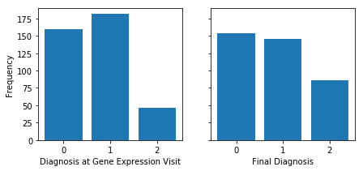
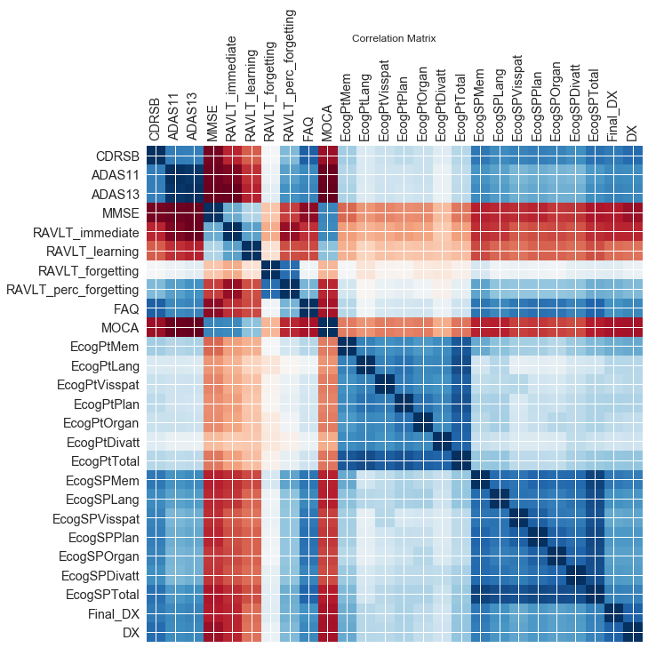
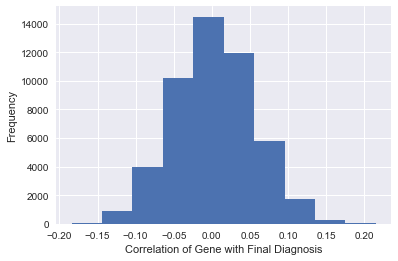

The ADNI database
-------------

The Alzheimer's Disease Neuroimaging Initiative is a program that collects cognitive data of a large number of people, ranging from cognitively normal over mildly cognitively impaired to having dementia. They collect this data at 63 sites across the United States and Canada according to a fixed protocol. ADNI has been running since 2004, and the protocols have slightly changed throughout the years, ranging from ADNI1, ADNIGO, ADNI2, and ADNI3, as research has evolved. The data is collected involves cognitive tests (a combination of on-site tests, self-reported assessment, and assessment by a person who is familiar with the patient), neuroimaging data, and biological data, including whole genome sequencing data, and, for ADNIGO onwards, also gene expression data. The purpose of ADNI is to provide data that can fuel future discoveries with regards to Alzheimer's. For instance, the ADNI whole genome sequencing data led to the identification of a novel genetic mutation that could lead to Alzheimer's - TOMM40.

Gene expression and ADNIMERGE
-------------
We decided to look at gene expression data, so we used that csv. The ADNI_Gene_Expression_Profile.csv file contains each patient in the columns, including the patient ID (an ADNI-specific ID that is given to each data to help integrate over various datasets), which protocol they were studied under, and at which visit the samples that were analysed for gene expression were taken (encoded in an ADNI specific code). There is then information on sample quality, and a quantified number for expression level for each gene. There are nearly 50.000 genes listed. The gene expression data is with respect to mRNA expression. For each gene there is a so-called "ProbeSet" which is how ADNI classified the genes. This is complete. For most of the genes, there is additionally information on LocusLink and Symbol, which is the most commonly used name for the gene.

Exploratory data analysis
-------------

A diagnosis of 0 is cognitively normal, 1 is mild cognitive impairment, and 2 is dementia. It appears that most of the patients who were diagnosed as cognitively normal during the visit where the gene expression data was measured stayed cognitively normal until their final visit, while a significant number of patients diagnosed with mild cognitive impairment were later diagnosed with dementia.

By looking at the second to last row of the correlation matrix, we can see how each cognitive test correlates to the final diagnosis. We know that diagnoses can be incorrect, so we can adjust by incorporating performance on cognitive tests which are correlated to final diagnosis. RAVLT Forgetting and self-reported Everyday Cognition tests are least correlated (study-partner-reported Everyday Cognition was more correlated), so we won’t include them.

The correlation of genes with the final diagnosis is approximately normally distributed, centered at 0 with the most extreme values having magnitudes of approximately 0.15 or higher. To make our first model, we used the genes with the most extreme correlations to the final diagnosis because we thought they might be involved in dementia pathways.

To view our process, please see [our documented exploratory data analysis](EDA_notebook.md).
