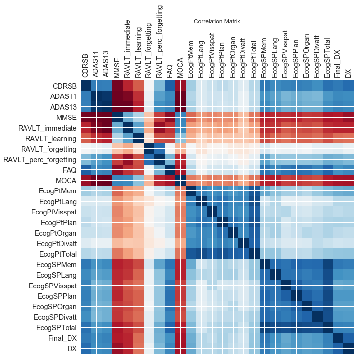

```python
%matplotlib inline
import pandas as pd
import numpy as np
import matplotlib
import matplotlib.pyplot as plt
import sys
from sklearn.linear_model import LogisticRegressionCV
from sklearn.metrics import accuracy_score
from sklearn.metrics import roc_auc_score
from numpy.random import randint
import seaborn as sns
```


```python
df_full = pd.read_csv('gene_expression_unique.csv', index_col = 0)
```


```python
df_full.head()
```


<div>
<style>
    .dataframe thead tr:only-child th {
        text-align: right;
    }

    .dataframe thead th {
        text-align: left;
    }

    .dataframe tbody tr th {
        vertical-align: top;
    }
</style>
<table border="1" class="dataframe">
  <thead>
    <tr style="text-align: right;">
      <th></th>
      <th>11715100_at</th>
      <th>11715101_s_at</th>
      <th>11715102_x_at</th>
      <th>11715103_x_at</th>
      <th>11715104_s_at</th>
      <th>11715105_at</th>
      <th>11715106_x_at</th>
      <th>11715107_s_at</th>
      <th>11715108_x_at</th>
      <th>11715109_at</th>
      <th>...</th>
      <th>EcogSPTotal_bl</th>
      <th>FDG_bl</th>
      <th>PIB_bl</th>
      <th>AV45_bl</th>
      <th>Years_bl</th>
      <th>Month_bl</th>
      <th>Month</th>
      <th>M</th>
      <th>update_stamp</th>
      <th>Final_DX</th>
    </tr>
  </thead>
  <tbody>
    <tr>
      <th>7</th>
      <td>2.420</td>
      <td>2.608</td>
      <td>1.790</td>
      <td>3.646</td>
      <td>2.276</td>
      <td>2.089</td>
      <td>2.600</td>
      <td>4.691</td>
      <td>2.361</td>
      <td>2.746</td>
      <td>...</td>
      <td>NaN</td>
      <td>NaN</td>
      <td>NaN</td>
      <td>NaN</td>
      <td>5.10609</td>
      <td>61.1475</td>
      <td>60</td>
      <td>60</td>
      <td>2017-10-06 23:19:46.0</td>
      <td>0</td>
    </tr>
    <tr>
      <th>14</th>
      <td>2.178</td>
      <td>2.347</td>
      <td>2.095</td>
      <td>3.926</td>
      <td>2.170</td>
      <td>2.094</td>
      <td>2.553</td>
      <td>5.084</td>
      <td>2.143</td>
      <td>3.047</td>
      <td>...</td>
      <td>2.62162</td>
      <td>1.06129</td>
      <td>NaN</td>
      <td>1.551950</td>
      <td>0.00000</td>
      <td>0.0000</td>
      <td>0</td>
      <td>0</td>
      <td>2017-10-06 23:19:54.0</td>
      <td>2</td>
    </tr>
    <tr>
      <th>22</th>
      <td>2.336</td>
      <td>2.382</td>
      <td>1.971</td>
      <td>3.768</td>
      <td>2.189</td>
      <td>2.161</td>
      <td>2.458</td>
      <td>4.848</td>
      <td>2.191</td>
      <td>3.138</td>
      <td>...</td>
      <td>1.02564</td>
      <td>1.29731</td>
      <td>NaN</td>
      <td>0.964352</td>
      <td>0.00000</td>
      <td>0.0000</td>
      <td>0</td>
      <td>0</td>
      <td>2017-10-06 23:19:55.0</td>
      <td>0</td>
    </tr>
    <tr>
      <th>27</th>
      <td>2.307</td>
      <td>2.500</td>
      <td>1.998</td>
      <td>3.789</td>
      <td>2.108</td>
      <td>2.070</td>
      <td>2.154</td>
      <td>4.800</td>
      <td>2.649</td>
      <td>2.708</td>
      <td>...</td>
      <td>1.00000</td>
      <td>1.30802</td>
      <td>NaN</td>
      <td>1.044580</td>
      <td>0.00000</td>
      <td>0.0000</td>
      <td>0</td>
      <td>0</td>
      <td>2017-10-06 23:19:55.0</td>
      <td>1</td>
    </tr>
    <tr>
      <th>35</th>
      <td>2.032</td>
      <td>2.179</td>
      <td>1.787</td>
      <td>3.229</td>
      <td>2.204</td>
      <td>2.236</td>
      <td>2.419</td>
      <td>4.200</td>
      <td>2.401</td>
      <td>2.570</td>
      <td>...</td>
      <td>1.05128</td>
      <td>1.44608</td>
      <td>NaN</td>
      <td>1.496110</td>
      <td>0.00000</td>
      <td>0.0000</td>
      <td>0</td>
      <td>0</td>
      <td>2017-10-06 23:19:55.0</td>
      <td>0</td>
    </tr>
  </tbody>
</table>
<p>5 rows × 49488 columns</p>
</div>


```python
df_full[df_full['DX'].isnull() == True].index
```


    Int64Index([232, 537, 825, 1394, 1684, 1691, 1982, 2226], dtype='int64')


```python
cols = df_full.dtypes
cols.to_csv('columntypes.txt')
```


```python
X_full = df_full.iloc[:,0:49386]
```


```python
def for_loop_status(length, index = 0):
    sys.stdout.write('\r%f%%' % ((index/length)*100))
    sys.stdout.flush()
    index += 1
    return(index)
```


```python
"""
Function
--------
scale_predictor

Inputs
------
df = the dataframe of data
predictor = str containing the name of the column to be scaled

Returns
-------
the df dataframe, with the values
in the column now scaled by the mean and std
of the predictor

"""
def scale_predictor(df, predictor):
    mean = df[predictor].mean() #get mean
    std = df[predictor].std() #get training standard deviation
    df[predictor] = (df[predictor] - mean)/std #scale df set
    return df
```


```python
# standardize gene expression data
gene_cols = X_full.columns
length = len(gene_cols) - 1
index = 0
for gene in gene_cols:
    df_full = scale_predictor(df_full, gene)
    index = for_loop_status(length, index)
```


    100.000000%


```python
# split into train and test
np.random.seed(9001)
msk = np.random.rand(len(df_full)) < 0.5
df_train = df_full[msk]
df_test = df_full[~msk]

X_train = df_train.iloc[:,0:49386]
X_test = df_test.iloc[:,0:49386]
y_train = df_train['Final_DX']
y_test = df_test['Final_DX']
```


```python
# compute correlations of Final_DX with all genes
gene_corrs = []
gene_cols = X_full.columns
length = len(gene_cols) - 1
index = 0
for gene in gene_cols:
    gene_corrs.append(X_full[gene].corr(df_full['Final_DX']))
    index = for_loop_status(length, index)
```


    100.000000%


```python
plt.hist(gene_corrs);
plt.xlabel('Correlation of Gene with Final Diagnosis')
plt.ylabel('Frequency')
plt.show()
```


```python
# store correlation data in dataframe
gene_corr_df = pd.DataFrame()
gene_corr_df['gene'] = gene_cols
gene_corr_df['corr'] = gene_corrs
gene_corr_df = gene_corr_df.sort_values('corr')
```


```python
# play around with this cell to look at using different predictors

#'''
n = 5
top_neg_corr = gene_corr_df.head(n)
top_pos_corr = gene_corr_df.tail(n)
top_corrs = pd.concat([top_pos_corr, top_neg_corr])
top_genes = top_corrs['gene'].values
top_corrs

'''
cutoff = 0.15
top_neg_corr = gene_corr_df.loc[gene_corr_df['corr'] <= -cutoff]
top_pos_corr = gene_corr_df.loc[gene_corr_df['corr'] >= cutoff]
top_corrs = pd.concat([top_pos_corr, top_neg_corr])
top_genes = top_corrs['gene'].values
len(top_corrs)
'''
```


    "\ncutoff = 0.15\ntop_neg_corr = gene_corr_df.loc[gene_corr_df['corr'] <= -cutoff]\ntop_pos_corr = gene_corr_df.loc[gene_corr_df['corr'] >= cutoff]\ntop_corrs = pd.concat([top_pos_corr, top_neg_corr])\ntop_genes = top_corrs['gene'].values\nlen(top_corrs)\n"


```python
top_corrs
# 2 highly correlated genes are FCRL1 and STMN4, not sure exactly which ones below they are
```


<div>
<style>
    .dataframe thead tr:only-child th {
        text-align: right;
    }

    .dataframe thead th {
        text-align: left;
    }

    .dataframe tbody tr th {
        vertical-align: top;
    }
</style>
<table border="1" class="dataframe">
  <thead>
    <tr style="text-align: right;">
      <th></th>
      <th>gene</th>
      <th>corr</th>
    </tr>
  </thead>
  <tbody>
    <tr>
      <th>10038</th>
      <td>11725138_at</td>
      <td>0.186508</td>
    </tr>
    <tr>
      <th>22894</th>
      <td>11737994_a_at</td>
      <td>0.188425</td>
    </tr>
    <tr>
      <th>3660</th>
      <td>11718760_a_at</td>
      <td>0.198810</td>
    </tr>
    <tr>
      <th>48698</th>
      <td>11763798_a_at</td>
      <td>0.206025</td>
    </tr>
    <tr>
      <th>18413</th>
      <td>11733513_a_at</td>
      <td>0.215151</td>
    </tr>
    <tr>
      <th>6532</th>
      <td>11721632_a_at</td>
      <td>-0.184159</td>
    </tr>
    <tr>
      <th>21780</th>
      <td>11736880_x_at</td>
      <td>-0.175599</td>
    </tr>
    <tr>
      <th>7416</th>
      <td>11722516_at</td>
      <td>-0.174379</td>
    </tr>
    <tr>
      <th>41410</th>
      <td>11756510_a_at</td>
      <td>-0.173058</td>
    </tr>
    <tr>
      <th>31740</th>
      <td>11746840_a_at</td>
      <td>-0.172506</td>
    </tr>
  </tbody>
</table>
</div>


```python
topcor_mod = {}

topcor_mod['Xtrain'] = X_train[top_genes].values
topcor_mod['Xtest'] = X_test[top_genes].values
topcor_mod['ytrain'] = y_train.values
topcor_mod['ytest'] = y_test.values
```


```python
# multinomial logistic
topcor_mod['logit_mn'] = LogisticRegressionCV(Cs=7, penalty='l2', random_state = 9001, multi_class='multinomial')
topcor_mod['logit_mn'].fit(topcor_mod['Xtrain'], topcor_mod['ytrain'])

topcor_mod['ypred_train'] = topcor_mod['logit_mn'].predict(topcor_mod['Xtrain'])
topcor_mod['ypred_test'] = topcor_mod['logit_mn'].predict(topcor_mod['Xtest'])

topcor_mod['yrand_train'] = randint(3, size = len(X_train))
topcor_mod['yrand_test'] = randint(3, size = len(X_test))

print('Logistic multinomial class. accuracy, train: ', accuracy_score(topcor_mod['ytrain'], topcor_mod['ypred_train']))
print('Logistic multinomial class. accuracy, test: ', accuracy_score(topcor_mod['ytest'], topcor_mod['ypred_test']))

print('Random class. accuracy, train: ', accuracy_score(topcor_mod['ytrain'], topcor_mod['yrand_train']))
print('Random class. accuracy, test: ', accuracy_score(topcor_mod['ytest'], topcor_mod['yrand_test']))
```


    Logistic multinomial class. accuracy, train:  0.481651376147
    Logistic multinomial class. accuracy, test:  0.47619047619
    Random class. accuracy, train:  0.321100917431
    Random class. accuracy, test:  0.350649350649
    


```python
# correlations for genes that are known to be related to Alzheimer's
print('TOMM40L', gene_corr_df.loc[gene_corr_df['gene'] == '11720197_a_at']['corr'].values[0])
print('TOMM40', gene_corr_df.loc[gene_corr_df['gene'] == '11751070_x_at']['corr'].values[0])
print('APOE', gene_corr_df.loc[gene_corr_df['gene'] == '11744068_x_at']['corr'].values[0])
```


    TOMM40L 0.0245944185485
    TOMM40 0.0253219692686
    APOE 0.00227285034402
    


```python
df_full.head()
```


<div>
<style>
    .dataframe thead tr:only-child th {
        text-align: right;
    }

    .dataframe thead th {
        text-align: left;
    }

    .dataframe tbody tr th {
        vertical-align: top;
    }
</style>
<table border="1" class="dataframe">
  <thead>
    <tr style="text-align: right;">
      <th></th>
      <th>11715100_at</th>
      <th>11715101_s_at</th>
      <th>11715102_x_at</th>
      <th>11715103_x_at</th>
      <th>11715104_s_at</th>
      <th>11715105_at</th>
      <th>11715106_x_at</th>
      <th>11715107_s_at</th>
      <th>11715108_x_at</th>
      <th>11715109_at</th>
      <th>...</th>
      <th>EcogSPTotal_bl</th>
      <th>FDG_bl</th>
      <th>PIB_bl</th>
      <th>AV45_bl</th>
      <th>Years_bl</th>
      <th>Month_bl</th>
      <th>Month</th>
      <th>M</th>
      <th>update_stamp</th>
      <th>Final_DX</th>
    </tr>
  </thead>
  <tbody>
    <tr>
      <th>7</th>
      <td>0.002025</td>
      <td>0.683454</td>
      <td>-1.309711</td>
      <td>0.312054</td>
      <td>-0.032759</td>
      <td>-0.383091</td>
      <td>0.621265</td>
      <td>-0.195728</td>
      <td>-0.213156</td>
      <td>-0.292406</td>
      <td>...</td>
      <td>NaN</td>
      <td>NaN</td>
      <td>NaN</td>
      <td>NaN</td>
      <td>5.10609</td>
      <td>61.1475</td>
      <td>60</td>
      <td>60</td>
      <td>2017-10-06 23:19:46.0</td>
      <td>0</td>
    </tr>
    <tr>
      <th>14</th>
      <td>-1.200304</td>
      <td>-0.475538</td>
      <td>0.337986</td>
      <td>1.221095</td>
      <td>-0.654416</td>
      <td>-0.348006</td>
      <td>0.385785</td>
      <td>1.308323</td>
      <td>-1.738426</td>
      <td>1.360530</td>
      <td>...</td>
      <td>2.62162</td>
      <td>1.06129</td>
      <td>NaN</td>
      <td>1.551950</td>
      <td>0.00000</td>
      <td>0.0000</td>
      <td>0</td>
      <td>0</td>
      <td>2017-10-06 23:19:54.0</td>
      <td>2</td>
    </tr>
    <tr>
      <th>22</th>
      <td>-0.415312</td>
      <td>-0.320118</td>
      <td>-0.331898</td>
      <td>0.708136</td>
      <td>-0.542987</td>
      <td>0.122134</td>
      <td>-0.090184</td>
      <td>0.405127</td>
      <td>-1.402587</td>
      <td>1.860255</td>
      <td>...</td>
      <td>1.02564</td>
      <td>1.29731</td>
      <td>NaN</td>
      <td>0.964352</td>
      <td>0.00000</td>
      <td>0.0000</td>
      <td>0</td>
      <td>0</td>
      <td>2017-10-06 23:19:55.0</td>
      <td>0</td>
    </tr>
    <tr>
      <th>27</th>
      <td>-0.559393</td>
      <td>0.203871</td>
      <td>-0.186036</td>
      <td>0.776314</td>
      <td>-1.018027</td>
      <td>-0.516415</td>
      <td>-1.613284</td>
      <td>0.221426</td>
      <td>1.801879</td>
      <td>-0.501082</td>
      <td>...</td>
      <td>1.00000</td>
      <td>1.30802</td>
      <td>NaN</td>
      <td>1.044580</td>
      <td>0.00000</td>
      <td>0.0000</td>
      <td>0</td>
      <td>0</td>
      <td>2017-10-06 23:19:55.0</td>
      <td>1</td>
    </tr>
    <tr>
      <th>35</th>
      <td>-1.925676</td>
      <td>-1.221556</td>
      <td>-1.325918</td>
      <td>-1.041767</td>
      <td>-0.455016</td>
      <td>0.648410</td>
      <td>-0.285581</td>
      <td>-2.074833</td>
      <td>0.066710</td>
      <td>-1.258907</td>
      <td>...</td>
      <td>1.05128</td>
      <td>1.44608</td>
      <td>NaN</td>
      <td>1.496110</td>
      <td>0.00000</td>
      <td>0.0000</td>
      <td>0</td>
      <td>0</td>
      <td>2017-10-06 23:19:55.0</td>
      <td>0</td>
    </tr>
  </tbody>
</table>
<p>5 rows × 49488 columns</p>
</div>


```python
# drop MRI columns
df_no_MRIs = df_full.drop(df_full.columns[49435:49444], axis=1)

# drop baselines except for Years_bl, Months_bl, Month, M
df_no_bl = df_no_MRIs.drop(df_no_MRIs.columns[49436:49473], axis=1)

# drop FDG, PIB, AV45
df_no_PET = df_no_bl.drop(df_no_bl.columns[49408:49411], axis=1)

df_no_PET.to_csv('FINAL_GENE_EXPRESSION.csv')
```


```python
# all cognitive test columns
cog_cols = df_no_PET.columns[49408:49432]

# cognitive test columns not including Ecog 
#cog_cols = df_no_bl.columns[49411:49421]

# find observations where cognitive test data is missing
missing_cog = df_no_PET.index[df_no_PET[cog_cols].isnull().any(axis=1)==True].tolist()

# drop rows where missing
df_no_missing_cog = df_no_PET.drop(missing_cog)

df_no_missing_cog.to_csv('DROPPED_GENE_EXPRESSION_UNIQUE.csv')
```


```python
df = df_no_missing_cog

cog_cols1 = df.columns[49411:49415]
fig, ax = plt.subplots(len(cog_cols1), 1, figsize=(5, 15))
for i in range(len(cog_cols1)):
    ax[i].hist(df[cog_cols1[i]])
    ax[i].set_xlabel(cog_cols1[i])
    ax[i].set_ylabel("Frequency")
```


```python
cog_cols2 = df.columns[49415:49421]
fig, ax = plt.subplots(len(cog_cols2), 1, figsize=(4, 25))
for i in range(len(cog_cols2)):
    ax[i].hist(df[cog_cols2[i]])
    ax[i].set_xlabel(cog_cols2[i])
    ax[i].set_ylabel("Frequency")
```


```python
EcogPt_cols = df.columns[49421:49428]
fig, ax = plt.subplots(len(EcogPt_cols), 2, figsize=(6, 24))
for i in range(len(EcogPt_cols)):
    ax[i][0].hist(df[EcogPt_cols[i]])
    ax[i][0].set_xlabel(EcogPt_cols[i])
    ax[i][0].set_ylabel("Frequency")
EcogSP_cols = df.columns[49428:49435]
for i in range(len(EcogSP_cols)):
    ax[i][1].hist(df[EcogSP_cols[i]])
    ax[i][1].set_xlabel(EcogSP_cols[i])
```


```python
fig, ax = plt.subplots(1, 2, figsize=(7,3), sharey=True)
dx_counts = df.groupby(['DX']).size()
ax[0].bar(dx_counts.index, dx_counts.values)
ax[0].set_xlabel('Diagnosis at Gene Expression Visit')
ax[0].set_ylabel("Frequency")
final_dx_counts = df.groupby(['Final_DX']).size()
ax[1].bar(final_dx_counts.index, final_dx_counts.values)
ax[1].set_xlabel('Final Diagnosis')
```


    <matplotlib.text.Text at 0x2306500d198>


```python
def plt_bar(col):
    counts = df.groupby([col]).size()
    plt.bar(counts.index, counts.values)
    plt.xlabel(col)
    plt.ylabel('Frequency')
```


```python
# APOE4 from ADNIMERGE
plt_bar('APOE4')
```


```python
# plot APOE4 and TOMM40 gene expression
fig, ax = plt.subplots(1, 2, figsize=(8, 3), sharey=True);
ax[0].hist(df['11744068_x_at']);
ax[0].set_title('APOE4 = 11744068_x_at');
ax[0].set_xlabel('Gene Expression');
ax[0].set_ylabel('Frequency');
ax[1].hist(df['11751070_x_at']);
ax[1].set_title('TOMM40 = 11751070_x_at');
ax[1].set_xlabel('Gene Expression');
```


```python
df_full = pd.read_csv('DROPPED_GENE_EXPRESSION_UNIQUE.csv', index_col = 0)
```


```python
cog_cols = df_full.columns[49408:49432]
df_cog = df_full[cog_cols]
df_cog['Final_DX'] = df_full['Final_DX']
df_cog['DX'] = df_full['DX']
df_cog.head()
```


    C:\Users\Jackie\Anaconda3\lib\site-packages\ipykernel_launcher.py:3: SettingWithCopyWarning: 
    A value is trying to be set on a copy of a slice from a DataFrame.
    Try using .loc[row_indexer,col_indexer] = value instead
    
    See the caveats in the documentation: http://pandas.pydata.org/pandas-docs/stable/indexing.html#indexing-view-versus-copy
      This is separate from the ipykernel package so we can avoid doing imports until
    C:\Users\Jackie\Anaconda3\lib\site-packages\ipykernel_launcher.py:4: SettingWithCopyWarning: 
    A value is trying to be set on a copy of a slice from a DataFrame.
    Try using .loc[row_indexer,col_indexer] = value instead
    
    See the caveats in the documentation: http://pandas.pydata.org/pandas-docs/stable/indexing.html#indexing-view-versus-copy
      after removing the cwd from sys.path.
    


<div>
<style>
    .dataframe thead tr:only-child th {
        text-align: right;
    }

    .dataframe thead th {
        text-align: left;
    }

    .dataframe tbody tr th {
        vertical-align: top;
    }
</style>
<table border="1" class="dataframe">
  <thead>
    <tr style="text-align: right;">
      <th></th>
      <th>CDRSB</th>
      <th>ADAS11</th>
      <th>ADAS13</th>
      <th>MMSE</th>
      <th>RAVLT_immediate</th>
      <th>RAVLT_learning</th>
      <th>RAVLT_forgetting</th>
      <th>RAVLT_perc_forgetting</th>
      <th>FAQ</th>
      <th>MOCA</th>
      <th>...</th>
      <th>EcogPtTotal</th>
      <th>EcogSPMem</th>
      <th>EcogSPLang</th>
      <th>EcogSPVisspat</th>
      <th>EcogSPPlan</th>
      <th>EcogSPOrgan</th>
      <th>EcogSPDivatt</th>
      <th>EcogSPTotal</th>
      <th>Final_DX</th>
      <th>DX</th>
    </tr>
  </thead>
  <tbody>
    <tr>
      <th>7</th>
      <td>0.0</td>
      <td>3.0</td>
      <td>4.0</td>
      <td>30.0</td>
      <td>57.0</td>
      <td>6.0</td>
      <td>9.0</td>
      <td>64.28570</td>
      <td>1.0</td>
      <td>28.0</td>
      <td>...</td>
      <td>1.58974</td>
      <td>1.125</td>
      <td>1.00000</td>
      <td>1.00000</td>
      <td>1.00</td>
      <td>1.00000</td>
      <td>1.0</td>
      <td>1.02564</td>
      <td>0</td>
      <td>0.0</td>
    </tr>
    <tr>
      <th>14</th>
      <td>1.5</td>
      <td>16.0</td>
      <td>24.0</td>
      <td>28.0</td>
      <td>38.0</td>
      <td>2.0</td>
      <td>2.0</td>
      <td>28.57140</td>
      <td>5.0</td>
      <td>20.0</td>
      <td>...</td>
      <td>1.87179</td>
      <td>3.250</td>
      <td>3.66667</td>
      <td>1.28571</td>
      <td>2.25</td>
      <td>1.83333</td>
      <td>3.0</td>
      <td>2.62162</td>
      <td>2</td>
      <td>1.0</td>
    </tr>
    <tr>
      <th>22</th>
      <td>0.0</td>
      <td>7.0</td>
      <td>8.0</td>
      <td>28.0</td>
      <td>55.0</td>
      <td>8.0</td>
      <td>1.0</td>
      <td>7.69231</td>
      <td>0.0</td>
      <td>21.0</td>
      <td>...</td>
      <td>1.17949</td>
      <td>1.000</td>
      <td>1.11111</td>
      <td>1.00000</td>
      <td>1.00</td>
      <td>1.00000</td>
      <td>1.0</td>
      <td>1.02564</td>
      <td>0</td>
      <td>0.0</td>
    </tr>
    <tr>
      <th>27</th>
      <td>1.0</td>
      <td>7.0</td>
      <td>9.0</td>
      <td>30.0</td>
      <td>40.0</td>
      <td>8.0</td>
      <td>5.0</td>
      <td>45.45450</td>
      <td>0.0</td>
      <td>22.0</td>
      <td>...</td>
      <td>1.33333</td>
      <td>1.000</td>
      <td>1.00000</td>
      <td>1.00000</td>
      <td>1.00</td>
      <td>1.00000</td>
      <td>1.0</td>
      <td>1.00000</td>
      <td>1</td>
      <td>1.0</td>
    </tr>
    <tr>
      <th>35</th>
      <td>0.0</td>
      <td>6.0</td>
      <td>11.0</td>
      <td>28.0</td>
      <td>44.0</td>
      <td>10.0</td>
      <td>4.0</td>
      <td>30.76920</td>
      <td>0.0</td>
      <td>25.0</td>
      <td>...</td>
      <td>1.00000</td>
      <td>1.250</td>
      <td>1.00000</td>
      <td>1.00000</td>
      <td>1.00</td>
      <td>1.00000</td>
      <td>1.0</td>
      <td>1.05128</td>
      <td>0</td>
      <td>0.0</td>
    </tr>
  </tbody>
</table>
<p>5 rows × 26 columns</p>
</div>


```python
df_cog.dtypes
```


    CDRSB                    float64
    ADAS11                   float64
    ADAS13                   float64
    MMSE                     float64
    RAVLT_immediate          float64
    RAVLT_learning           float64
    RAVLT_forgetting         float64
    RAVLT_perc_forgetting    float64
    FAQ                      float64
    MOCA                     float64
    EcogPtMem                float64
    EcogPtLang               float64
    EcogPtVisspat            float64
    EcogPtPlan               float64
    EcogPtOrgan              float64
    EcogPtDivatt             float64
    EcogPtTotal              float64
    EcogSPMem                float64
    EcogSPLang               float64
    EcogSPVisspat            float64
    EcogSPPlan               float64
    EcogSPOrgan              float64
    EcogSPDivatt             float64
    EcogSPTotal              float64
    Final_DX                   int64
    DX                       float64
    dtype: object


```python
corr_matrix = np.corrcoef(df_cog, rowvar = False)
corr_matrix
```


    array([[ 1.        ,  0.72595596,  0.72448254, -0.72693223, -0.54983633,
            -0.41349527,  0.13531603,  0.50752157,  0.83541761, -0.64208801,
             0.42488113,  0.25054816,  0.31406716,  0.3522995 ,  0.31471124,
             0.23360805,  0.37043629,  0.74627875,  0.67002019,  0.70750669,
             0.72122996,  0.70927219,  0.66226626,  0.77921219,  0.74329702,
             0.79999554],
           [ 0.72595596,  1.        ,  0.97536503, -0.74010809, -0.70484906,
            -0.52239185,  0.17120318,  0.6003241 ,  0.68103294, -0.74203874,
             0.37723257,  0.25088726,  0.30353582,  0.30068744,  0.31413028,
             0.18208519,  0.34370269,  0.64045876,  0.59291142,  0.52111462,
             0.54656956,  0.52576812,  0.51626722,  0.62784305,  0.67691687,
             0.66634175],
           [ 0.72448254,  0.97536503,  1.        , -0.74225321, -0.74210046,
            -0.55829236,  0.21254987,  0.64606462,  0.69906976, -0.76207338,
             0.39980388,  0.24329439,  0.30677058,  0.2976392 ,  0.30716968,
             0.18414702,  0.34731865,  0.67223941,  0.61414364,  0.55170066,
             0.57308682,  0.54460965,  0.54416608,  0.6570317 ,  0.70611628,
             0.6884414 ],
           [-0.72693223, -0.74010809, -0.74225321,  1.        ,  0.55420354,
             0.38091988, -0.12547378, -0.48886736, -0.67138809,  0.69574119,
            -0.38523506, -0.2679273 , -0.31170349, -0.29267507, -0.29644054,
            -0.15997242, -0.34300166, -0.56899714, -0.54439922, -0.53138358,
            -0.55190088, -0.50702393, -0.50887973, -0.59565317, -0.58137492,
            -0.64015524],
           [-0.54983633, -0.70484906, -0.74210046,  0.55420354,  1.        ,
             0.58930405, -0.20883137, -0.64666217, -0.52155058,  0.67778123,
            -0.25085059, -0.18683001, -0.21414021, -0.25159307, -0.2270124 ,
            -0.10994086, -0.24340705, -0.53409893, -0.50830876, -0.42480049,
            -0.4502949 , -0.46499869, -0.43444418, -0.52883971, -0.54964764,
            -0.5517273 ],
           [-0.41349527, -0.52239185, -0.55829236,  0.38091988,  0.58930405,
             1.        , -0.01351537, -0.45098195, -0.45990812,  0.48233425,
            -0.19400639, -0.07509272, -0.13869876, -0.12301068, -0.12965059,
            -0.11738273, -0.15329862, -0.46253206, -0.3937874 , -0.36093291,
            -0.40317845, -0.40252809, -0.37141983, -0.44838807, -0.37521946,
            -0.35857503],
           [ 0.13531603,  0.17120318,  0.21254987, -0.12547378, -0.20883137,
            -0.01351537,  1.        ,  0.78685439,  0.14709001, -0.17212907,
             0.13363396,  0.0078805 ,  0.08635397,  0.0953638 ,  0.03631829,
             0.0159913 ,  0.07454336,  0.26704559,  0.16616856,  0.18004155,
             0.16056552,  0.14210472,  0.20451499,  0.21387332,  0.22632986,
             0.17624476],
           [ 0.50752157,  0.6003241 ,  0.64606462, -0.48886736, -0.64666217,
            -0.45098195,  0.78685439,  1.        ,  0.52855721, -0.54668431,
             0.2830871 ,  0.10236598,  0.17497527,  0.19470922,  0.15063312,
             0.07141742,  0.19717252,  0.58638354,  0.47073049,  0.45727044,
             0.46251572,  0.45734574,  0.47037538,  0.54628752,  0.53332932,
             0.50488778],
           [ 0.83541761,  0.68103294,  0.69906976, -0.67138809, -0.52155058,
            -0.45990812,  0.14709001,  0.52855721,  1.        , -0.60679533,
             0.36940567,  0.15767656,  0.27058565,  0.27772001,  0.29762753,
             0.17829582,  0.30401924,  0.75622184,  0.68906726,  0.75207561,
             0.77476964,  0.76156638,  0.7023913 ,  0.81585796,  0.64503771,
             0.68407497],
           [-0.64208801, -0.74203874, -0.76207338,  0.69574119,  0.67778123,
             0.48233425, -0.17212907, -0.54668431, -0.60679533,  1.        ,
            -0.3421592 , -0.28016391, -0.33354396, -0.31511666, -0.33101323,
            -0.20491   , -0.3544609 , -0.56082338, -0.56542576, -0.48111276,
            -0.50704016, -0.47348477, -0.4576133 , -0.57120722, -0.61060668,
            -0.61635625],
           [ 0.42488113,  0.37723257,  0.39980388, -0.38523506, -0.25085059,
            -0.19400639,  0.13363396,  0.2830871 ,  0.36940567, -0.3421592 ,
             1.        ,  0.71512227,  0.651985  ,  0.6779055 ,  0.62237466,
             0.66378821,  0.86617869,  0.56129949,  0.48225187,  0.42060258,
             0.4131767 ,  0.37077917,  0.44452759,  0.5076667 ,  0.54946895,
             0.56614592],
           [ 0.25054816,  0.25088726,  0.24329439, -0.2679273 , -0.18683001,
            -0.07509272,  0.0078805 ,  0.10236598,  0.15767656, -0.28016391,
             0.71512227,  1.        ,  0.71623316,  0.76860019,  0.68662479,
             0.69410107,  0.90100701,  0.29460874,  0.3704052 ,  0.2024294 ,
             0.2114159 ,  0.20050056,  0.27335802,  0.29542543,  0.36730781,
             0.37215924],
           [ 0.31406716,  0.30353582,  0.30677058, -0.31170349, -0.21414021,
            -0.13869876,  0.08635397,  0.17497527,  0.27058565, -0.33354396,
             0.651985  ,  0.71623316,  1.        ,  0.73673298,  0.67271542,
             0.64216424,  0.84604975,  0.34056691,  0.35886082,  0.36694159,
             0.29192708,  0.27587397,  0.31376679,  0.36275974,  0.34298997,
             0.36546773],
           [ 0.3522995 ,  0.30068744,  0.2976392 , -0.29267507, -0.25159307,
            -0.12301068,  0.0953638 ,  0.19470922,  0.27772001, -0.31511666,
             0.6779055 ,  0.76860019,  0.73673298,  1.        ,  0.77521358,
             0.70730032,  0.88148802,  0.39907783,  0.40567187,  0.27695577,
             0.32769622,  0.31308404,  0.35180438,  0.38899002,  0.3962039 ,
             0.38829823],
           [ 0.31471124,  0.31413028,  0.30716968, -0.29644054, -0.2270124 ,
            -0.12965059,  0.03631829,  0.15063312,  0.29762753, -0.33101323,
             0.62237466,  0.68662479,  0.67271542,  0.77521358,  1.        ,
             0.67575645,  0.84001148,  0.36639224,  0.41008721,  0.2863116 ,
             0.32034531,  0.37362163,  0.34782942,  0.39343498,  0.34863275,
             0.33898221],
           [ 0.23360805,  0.18208519,  0.18414702, -0.15997242, -0.10994086,
            -0.11738273,  0.0159913 ,  0.07141742,  0.17829582, -0.20491   ,
             0.66378821,  0.69410107,  0.64216424,  0.70730032,  0.67575645,
             1.        ,  0.82658406,  0.32438096,  0.30808903,  0.24732689,
             0.24402264,  0.25738539,  0.34007455,  0.31844684,  0.29547577,
             0.30262249],
           [ 0.37043629,  0.34370269,  0.34731865, -0.34300166, -0.24340705,
            -0.15329862,  0.07454336,  0.19717252,  0.30401924, -0.3544609 ,
             0.86617869,  0.90100701,  0.84604975,  0.88148802,  0.84001148,
             0.82658406,  1.        ,  0.45212277,  0.45965803,  0.35284192,
             0.35250415,  0.3444444 ,  0.40172051,  0.44382944,  0.46133418,
             0.46959874],
           [ 0.74627875,  0.64045876,  0.67223941, -0.56899714, -0.53409893,
            -0.46253206,  0.26704559,  0.58638354,  0.75622184, -0.56082338,
             0.56129949,  0.29460874,  0.34056691,  0.39907783,  0.36639224,
             0.32438096,  0.45212277,  1.        ,  0.79689825,  0.76503161,
             0.81500031,  0.79487734,  0.80415491,  0.93138079,  0.74750739,
             0.72617694],
           [ 0.67002019,  0.59291142,  0.61414364, -0.54439922, -0.50830876,
            -0.3937874 ,  0.16616856,  0.47073049,  0.68906726, -0.56542576,
             0.48225187,  0.3704052 ,  0.35886082,  0.40567187,  0.41008721,
             0.30808903,  0.45965803,  0.79689825,  1.        ,  0.76786358,
             0.76186641,  0.72790841,  0.76914477,  0.89884423,  0.64600318,
             0.6335787 ],
           [ 0.70750669,  0.52111462,  0.55170066, -0.53138358, -0.42480049,
            -0.36093291,  0.18004155,  0.45727044,  0.75207561, -0.48111276,
             0.42060258,  0.2024294 ,  0.36694159,  0.27695577,  0.2863116 ,
             0.24732689,  0.35284192,  0.76503161,  0.76786358,  1.        ,
             0.84148118,  0.75145986,  0.73656158,  0.88610541,  0.56693973,
             0.58416393],
           [ 0.72122996,  0.54656956,  0.57308682, -0.55190088, -0.4502949 ,
            -0.40317845,  0.16056552,  0.46251572,  0.77476964, -0.50704016,
             0.4131767 ,  0.2114159 ,  0.29192708,  0.32769622,  0.32034531,
             0.24402264,  0.35250415,  0.81500031,  0.76186641,  0.84148118,
             1.        ,  0.83724881,  0.78277157,  0.9146317 ,  0.62352578,
             0.62168968],
           [ 0.70927219,  0.52576812,  0.54460965, -0.50702393, -0.46499869,
            -0.40252809,  0.14210472,  0.45734574,  0.76156638, -0.47348477,
             0.37077917,  0.20050056,  0.27587397,  0.31308404,  0.37362163,
             0.25738539,  0.3444444 ,  0.79487734,  0.72790841,  0.75145986,
             0.83724881,  1.        ,  0.82322786,  0.9002772 ,  0.60046239,
             0.59747527],
           [ 0.66226626,  0.51626722,  0.54416608, -0.50887973, -0.43444418,
            -0.37141983,  0.20451499,  0.47037538,  0.7023913 , -0.4576133 ,
             0.44452759,  0.27335802,  0.31376679,  0.35180438,  0.34782942,
             0.34007455,  0.40172051,  0.80415491,  0.76914477,  0.73656158,
             0.78277157,  0.82322786,  1.        ,  0.89451915,  0.6154028 ,
             0.61365549],
           [ 0.77921219,  0.62784305,  0.6570317 , -0.59565317, -0.52883971,
            -0.44838807,  0.21387332,  0.54628752,  0.81585796, -0.57120722,
             0.5076667 ,  0.29542543,  0.36275974,  0.38899002,  0.39343498,
             0.31844684,  0.44382944,  0.93138079,  0.89884423,  0.88610541,
             0.9146317 ,  0.9002772 ,  0.89451915,  1.        ,  0.71181206,
             0.70520889],
           [ 0.74329702,  0.67691687,  0.70611628, -0.58137492, -0.54964764,
            -0.37521946,  0.22632986,  0.53332932,  0.64503771, -0.61060668,
             0.54946895,  0.36730781,  0.34298997,  0.3962039 ,  0.34863275,
             0.29547577,  0.46133418,  0.74750739,  0.64600318,  0.56693973,
             0.62352578,  0.60046239,  0.6154028 ,  0.71181206,  1.        ,
             0.8287829 ],
           [ 0.79999554,  0.66634175,  0.6884414 , -0.64015524, -0.5517273 ,
            -0.35857503,  0.17624476,  0.50488778,  0.68407497, -0.61635625,
             0.56614592,  0.37215924,  0.36546773,  0.38829823,  0.33898221,
             0.30262249,  0.46959874,  0.72617694,  0.6335787 ,  0.58416393,
             0.62168968,  0.59747527,  0.61365549,  0.70520889,  0.8287829 ,
             1.        ]])


```python
print("Cognitive Test Correlations with Final_DX\n")
final_dx_df = pd.DataFrame()
final_dx_df['cog'] = df_cog.columns
final_dx_df['val'] = corr_matrix[24,:]
final_dx_df = final_dx_df.sort_values(['val'])
final_dx_df.head(20)
```


    Cognitive Test Correlations with Final_DX
    
    


<div>
<style>
    .dataframe thead tr:only-child th {
        text-align: right;
    }

    .dataframe thead th {
        text-align: left;
    }

    .dataframe tbody tr th {
        vertical-align: top;
    }
</style>
<table border="1" class="dataframe">
  <thead>
    <tr style="text-align: right;">
      <th></th>
      <th>cog</th>
      <th>val</th>
    </tr>
  </thead>
  <tbody>
    <tr>
      <th>9</th>
      <td>MOCA</td>
      <td>-0.610607</td>
    </tr>
    <tr>
      <th>3</th>
      <td>MMSE</td>
      <td>-0.581375</td>
    </tr>
    <tr>
      <th>4</th>
      <td>RAVLT_immediate</td>
      <td>-0.549648</td>
    </tr>
    <tr>
      <th>5</th>
      <td>RAVLT_learning</td>
      <td>-0.375219</td>
    </tr>
    <tr>
      <th>6</th>
      <td>RAVLT_forgetting</td>
      <td>0.226330</td>
    </tr>
    <tr>
      <th>15</th>
      <td>EcogPtDivatt</td>
      <td>0.295476</td>
    </tr>
    <tr>
      <th>12</th>
      <td>EcogPtVisspat</td>
      <td>0.342990</td>
    </tr>
    <tr>
      <th>14</th>
      <td>EcogPtOrgan</td>
      <td>0.348633</td>
    </tr>
    <tr>
      <th>11</th>
      <td>EcogPtLang</td>
      <td>0.367308</td>
    </tr>
    <tr>
      <th>13</th>
      <td>EcogPtPlan</td>
      <td>0.396204</td>
    </tr>
    <tr>
      <th>16</th>
      <td>EcogPtTotal</td>
      <td>0.461334</td>
    </tr>
    <tr>
      <th>7</th>
      <td>RAVLT_perc_forgetting</td>
      <td>0.533329</td>
    </tr>
    <tr>
      <th>10</th>
      <td>EcogPtMem</td>
      <td>0.549469</td>
    </tr>
    <tr>
      <th>19</th>
      <td>EcogSPVisspat</td>
      <td>0.566940</td>
    </tr>
    <tr>
      <th>21</th>
      <td>EcogSPOrgan</td>
      <td>0.600462</td>
    </tr>
    <tr>
      <th>22</th>
      <td>EcogSPDivatt</td>
      <td>0.615403</td>
    </tr>
    <tr>
      <th>20</th>
      <td>EcogSPPlan</td>
      <td>0.623526</td>
    </tr>
    <tr>
      <th>8</th>
      <td>FAQ</td>
      <td>0.645038</td>
    </tr>
    <tr>
      <th>18</th>
      <td>EcogSPLang</td>
      <td>0.646003</td>
    </tr>
    <tr>
      <th>1</th>
      <td>ADAS11</td>
      <td>0.676917</td>
    </tr>
  </tbody>
</table>
</div>


```python
print("Cognitive Test Correlations with DX\n")
dx_df = pd.DataFrame()
dx_df['cog'] = df_cog.columns
dx_df['val'] = corr_matrix[25,:]
dx_df = final_dx_df.sort_values(['val'])
dx_df.head(20)
```


    Cognitive Test Correlations with DX
    
    


<div>
<style>
    .dataframe thead tr:only-child th {
        text-align: right;
    }

    .dataframe thead th {
        text-align: left;
    }

    .dataframe tbody tr th {
        vertical-align: top;
    }
</style>
<table border="1" class="dataframe">
  <thead>
    <tr style="text-align: right;">
      <th></th>
      <th>cog</th>
      <th>val</th>
    </tr>
  </thead>
  <tbody>
    <tr>
      <th>9</th>
      <td>MOCA</td>
      <td>-0.610607</td>
    </tr>
    <tr>
      <th>3</th>
      <td>MMSE</td>
      <td>-0.581375</td>
    </tr>
    <tr>
      <th>4</th>
      <td>RAVLT_immediate</td>
      <td>-0.549648</td>
    </tr>
    <tr>
      <th>5</th>
      <td>RAVLT_learning</td>
      <td>-0.375219</td>
    </tr>
    <tr>
      <th>6</th>
      <td>RAVLT_forgetting</td>
      <td>0.226330</td>
    </tr>
    <tr>
      <th>15</th>
      <td>EcogPtDivatt</td>
      <td>0.295476</td>
    </tr>
    <tr>
      <th>12</th>
      <td>EcogPtVisspat</td>
      <td>0.342990</td>
    </tr>
    <tr>
      <th>14</th>
      <td>EcogPtOrgan</td>
      <td>0.348633</td>
    </tr>
    <tr>
      <th>11</th>
      <td>EcogPtLang</td>
      <td>0.367308</td>
    </tr>
    <tr>
      <th>13</th>
      <td>EcogPtPlan</td>
      <td>0.396204</td>
    </tr>
    <tr>
      <th>16</th>
      <td>EcogPtTotal</td>
      <td>0.461334</td>
    </tr>
    <tr>
      <th>7</th>
      <td>RAVLT_perc_forgetting</td>
      <td>0.533329</td>
    </tr>
    <tr>
      <th>10</th>
      <td>EcogPtMem</td>
      <td>0.549469</td>
    </tr>
    <tr>
      <th>19</th>
      <td>EcogSPVisspat</td>
      <td>0.566940</td>
    </tr>
    <tr>
      <th>21</th>
      <td>EcogSPOrgan</td>
      <td>0.600462</td>
    </tr>
    <tr>
      <th>22</th>
      <td>EcogSPDivatt</td>
      <td>0.615403</td>
    </tr>
    <tr>
      <th>20</th>
      <td>EcogSPPlan</td>
      <td>0.623526</td>
    </tr>
    <tr>
      <th>8</th>
      <td>FAQ</td>
      <td>0.645038</td>
    </tr>
    <tr>
      <th>18</th>
      <td>EcogSPLang</td>
      <td>0.646003</td>
    </tr>
    <tr>
      <th>1</th>
      <td>ADAS11</td>
      <td>0.676917</td>
    </tr>
  </tbody>
</table>
</div>


```python
dpal = sns.choose_colorbrewer_palette('diverging', as_cmap=True)
plt.rcParams["figure.figsize"] = [10,10]
plt.matshow(corr_matrix, cmap=dpal)
ax = plt.gca()
ax.tick_params(axis='both', which='both',length=0);
plt.title("Correlation Matrix", y=1.2)
plt.xticks(range(26), df_cog.columns, rotation=90, fontsize = 'large')
plt.yticks(range(26), df_cog.columns, fontsize = 'large');
```




